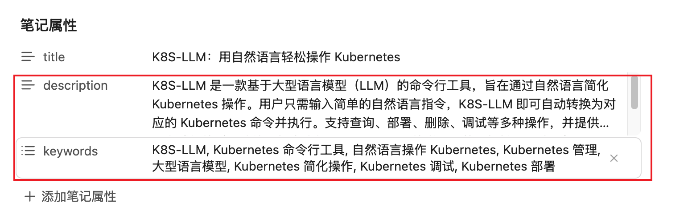
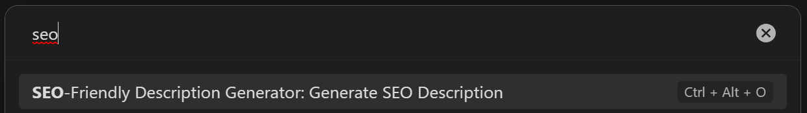

# SEO Friendly Description Generator

## 介绍

此插件利用大模型在obsidian中给markdown文件生成对SEO友好的description。

效果预览如图中红框标出来的部分。

## 参数说明

**目前支持openai和azure openai**

| 参数名              | 说明                                                                                                                          | 类型   | 默认值                                     |
| ------------------- | ----------------------------------------------------------------------------------------------------------------------------- | ------ | ------------------------------------------ |
| apiKey              | 调用大模型需要的key                                                                                                           | string | 无                                         |
| useAzure            | 是否使用azure openai                                                                                                          | string | false                                      |
| apiUrl              | 大模型的调用接口，如果**useAzure**为True，这个参数应该填写azure openai的endpoint地址，格式为：https://xxxxx.openai.azure.com/ | string | https://api.openai.com/v1/chat/completions |
| model               | 大模型的名称,如果**useAzure**为True，这个参数不用填                                                                           | string | gpt-3.5-turbo                              |
| maxTokens           | 大模型生成的最大token数量                                                                                                     | number | 150                                        |
| temperature         | 大模型生成的温度                                                                                                              | number | 0.8                                        |
| azureApiVersion     | azure api版本， **useAzure**为False时，可以不填                                                                               | string | 2023-05-15                                 |
| azureDeploymentName | azure deployment name，**useAzure**为False时，可以不填                                                                        | string | 无                                         |

## 使用

先打开需要生成description的markdown文件，然后在obsidian的命令行中搜索seo，出现如下命令，点击即可。

也可以绑定一个快捷键，方便使用，比如我这里绑定的是Ctrl + Alt + O

